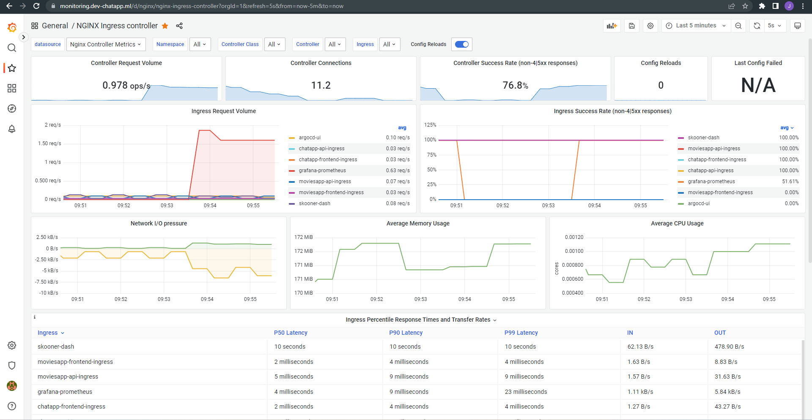

# Trainee Progam Final Project

- [Trainee Progam Final Project](#trainee-progam-final-project)
- [Overview](#overview)
- [Description](#description)
- [Apps deployed](#apps-deployed)
  - [Chat App](#chat-app)
    - [Description](#description-1)
    - [App images](#app-images)
    - [Login](#login)
    - [Register](#register)
    - [Messaging](#messaging)
  - [Movies App](#movies-app)
    - [Description](#description-2)
    - [App images](#app-images-1)
    - [Login](#login-1)
    - [Register](#register-1)
    - [Home](#home)
    - [Catalog](#catalog)
    - [History](#history)
    - [Shopping](#shopping)
    - [Payment information](#payment-information)
    - [Checkout](#checkout)
- [Environments](#environments)
  - [How were managed the environments?](#how-were-managed-the-environments)
  - [GCP Projects Used](#gcp-projects-used)
  - [Terraform](#terraform)
    - [Terraform triggers](#terraform-triggers)
    - [Development](#development)
    - [Google Secret Manager](#google-secret-manager)
    - [Production](#production)
  - [GitHub Actions](#github-actions)
    - [Development pipelines](#development-pipelines)
    - [Producton pipelines](#producton-pipelines)
  - [GitOps Solution](#gitops-solution)
  - [Development](#development-1)
    - [Diagram](#diagram)
    - [GCP Recources used](#gcp-recources-used)
    - [Monitoring](#monitoring)
    - [Prometheus + Grafana](#prometheus--grafana)
    - [Promehteus Blacbox Exporter](#promehteus-blacbox-exporter)
    - [Nginx Controller Metrics](#nginx-controller-metrics)
    - [Skooner](#skooner)
    - [Costs](#costs)
  - [Production](#production-1)
    - [Diagram](#diagram-1)
    - [GCP Recources used](#gcp-recources-used-1)
    - [Monitoring](#monitoring-1)
    - [Prometheus + Grafana](#prometheus--grafana-1)
    - [Promehteus Blackbox Exporter](#promehteus-blackbox-exporter)
    - [Nginx Controller Metrics](#nginx-controller-metrics-1)
    - [Skooner](#skooner-1)
    - [Costs](#costs-1)

# Overview

# Description

# Apps deployed

## Chat App

### Description

A simple messaging app where you can talk with your family and friend on a fast way without providing sensible data when the user is registered.

You can find the commands used for the application and infrastructure configuration <a href="https://github.com/applaudo-gcp-tp/jsolares_finalproject_documentation/blob/main/CommandsUsed.md"> here </a>

### App images

### Login

### Register

### Messaging

## Movies App

### Description

This is a renting movies app, where the user can rent a lot of movies from the movie catalog. 

### App images

### Login

### Register

### Home

### Catalog

### History

### Shopping

### Payment information

### Checkout

# Environments

## How were managed the environments?
On this project, we hace all the resources and infrastructure separated in two environments, development and production.

## GCP Projects Used 

| **Environment** | **GCP Project Name Used**  |
|-----------------|----------------------------|
| Development     | FinalProject-tp            |
| Production      | FinalProject-tp-production |

## Terraform

For the management of both applications infrastructure Terraform was used, because provides an Infrastructure as Code Solution, where we can have all the Google Cloud Platform Resources that can be created with a CI/CD pipeline

### Terraform triggers

### Development

| **Trigger**     | **Action**  |
|-----------------|----------------------------|
| tf-plan        | Executes a terraform plan when the develop branch is pushed          |
| tf-apply      | Executes a terraform apply when the staging branch is pushed |

### Google Secret Manager

For added security, the sensible information was managed by Google Secret Manager, where we can store all the important information such as tokens, string connections, users and passowrd for databases.

### Production

| **Trigger**     | **Action**  |
|-----------------|----------------------------|
| tf-plan        | Executes a terraform plan when the production branch is pushed          |
| tf-apply      | Executes a terraform apply when the main branch is merged from production branch |

## GitHub Actions

For this project, the registry used is **Google Container Registry**, for this purpose a CI/CD pipeline was build using **GitHub Actions**. 
A different CI/CD pipeline was built for each application and environment used in this project.

### Development pipelines

| **App**             | **Link to pipeline file** |
|---------------------|---------------------------|
| Chat App Services   | <a href="https://github.com/applaudo-gcp-tp/jsolares_finalproject_chat_app_services/tree/develop/.github/workflows">Link</a> |
| Chat App Frontend   |  <a href="https://github.com/applaudo-gcp-tp/jsolares_finalproject_chat_app_frontend/tree/develop/.github/workflows">Link</a>  |
| Movies App Services |   <a href="https://github.com/applaudo-gcp-tp/jsolares_finalproject_games_app_services/tree/develop/.github/workflows"> Link </a> |
| Movies App Frontend |   <a href="https://github.com/applaudo-gcp-tp/jsolares_finalproject_games_app_frontend/tree/develop/.github/workflows"> Link </a>                        |

### Producton pipelines

| **App**             | **Link to pipeline file** |
|---------------------|---------------------------|
| Chat App Services   | <a href="https://github.com/applaudo-gcp-tp/jsolares_finalproject_chat_app_services/tree/production/.github/workflows"> Link </a>                          |
| Chat App Frontend   | <a href="https://github.com/applaudo-gcp-tp/jsolares_finalproject_chat_app_frontend/tree/production/.github/workflows"> Link </a>                        |
| Movies App Services | <a href="https://github.com/applaudo-gcp-tp/jsolares_finalproject_games_app_services/tree/production/.github/workflows"> Link </a>                       |
| Movies App Frontend | <a href="https://github.com/applaudo-gcp-tp/jsolares_finalproject_games_app_frontend/tree/production/.github/workflows"> Link </a>                          |

## GitOps Solution

ArgoCD was used for the application configuration powered by Kubernetes, where each one of the frontend, monitoring, scaling and services that are managed with ArgoCD that allow to keep the state of the appllication syncronized with the "Source of Truth" that is all our repositories that are located in GitHub.

When the GitHub Repository has a new change (push), the application will be synchronized and will apply the new changes.

The ArgoCD Dashboard (for both environments) looks like this:

And the GitHub and Helm repositories connected with argoCD

## Development

### Diagram

### GCP Recources used

| Resource Name                                                  | Description                            |
|----------------------------------------------------------------|----------------------------------------|
| Cloud SQL for MySQL: Regional   - Micro instance in Americas   | CP-DB-F1-MICRO                         |
| Cloud SQL for MySQL: Regional - Standard   storage in Americas | CP-DB-F1-MICRO                         |
| E2 Instance Core running in   Americas                         | CP-COMPUTEENGINE-VMIMAGE-E2-STANDARD-2 |
| E2 Instance Ram running in Americas                            | CP-COMPUTEENGINE-VMIMAGE-E2-STANDARD-2 |
| Cloud Build - Default                                          | CP-CLOUDBUILD                          |
| Standard Storage US Regional                                   | CP-BIGSTORE-STANDARD                   |
| Standard Storage US Regional                                   | CP-BIGSTORE-STANDARD                   |
| N1 Predefined Instance Core running in   Americas              | CP-COMPUTEENGINE-VMIMAGE-N1-STANDARD-1 |
| N1 Predefined Instance Ram   running in Americas               | CP-COMPUTEENGINE-VMIMAGE-N1-STANDARD-1 |
| Balanced PD Capacity                                           | CP-COMPUTEENGINE-STORAGE-PD-READONLY   |

The estimated cost of the development environment of the project you can find it <a href="https://github.com/applaudo-gcp-tp/jsolares_finalproject_documentation/blob/main/developmentcosts.pdf">**here**</a> 

### Monitoring

### Prometheus + Grafana

For the monitoring of development environment Grafana and prometheus was used.
Prometheus is an open source monitoring system for which Grafana provides out-of-the-box support. This topic walks you through the steps to create a series of dashboards in Grafana to display system metrics for a server monitored by Prometheus

### Promehteus Blacbox Exporter

Blackbox exporter provides us an exploration of several network protocols and give to user multiple metrics, that can be useful to get a general state of the appllication.

Metrics collected by Prometheus blackbox Exporter:

* Endpoint status 
* Response time 
* Redirect information 
* Certificate expiration dates.

### Nginx Controller Metrics 

Nginx controller metrics collects the following metrics

* Ingress resquest volume
* Average Memory usage
* Average CPU usage
* Ingress Percentile Response times and transfer rates
* Ingress Certificate 

### Skooner

Skooner is an solution that provides us for an overview of the Kubernetes Cluster, with a web GUI instead of command line.

### Costs

## Production

### Diagram

### GCP Recources used

| Resource Name                                                  | Description                            |
|----------------------------------------------------------------|----------------------------------------|
| E2 Instance Core running in Americas                           | CP-COMPUTEENGINE-VMIMAGE-E2-STANDARD-2 |
| E2 Instance Ram running in Americas                            | CP-COMPUTEENGINE-VMIMAGE-E2-STANDARD-2 |
| Cloud Build - Default                                          | CP-CLOUDBUILD                          |
| Standard Storage US Regional                                   | CP-BIGSTORE-STANDARD                   |
| Standard Storage US Regional                                   | CP-BIGSTORE-STANDARD                   |
| N1 Predefined Instance Core running in   Americas              | CP-COMPUTEENGINE-VMIMAGE-N1-STANDARD-2 |
| N1 Predefined Instance Ram running in   Americas               | CP-COMPUTEENGINE-VMIMAGE-N1-STANDARD-2 |
| Cloud SQL for MySQL: Regional - Micro   instance in Americas   | CP-DB-F1-MICRO                         |
| Cloud SQL for MySQL: Regional - Standard   storage in Americas | CP-DB-F1-MICRO                         |
| Balanced PD Capacity                                           | CP-COMPUTEENGINE-STORAGE-PD-READONLY   |

The estimated cost of the of the project for a production environment you can find it <a href="https://github.com/applaudo-gcp-tp/jsolares_finalproject_documentation/blob/main/productioncosts.pdf">**here**</a> 

(The estimated value of the production environment is monthly).

* Note that the price for the production environment price is higher than the develompment environment, due to multiple factors:
  * The Kubernetes Cluster has more capacity for bigger workloads and horizontal scaling of applications.
  * The Cloud SQL instance has the feature of High Availabilty enabled.
 

### Monitoring

### Prometheus + Grafana

### Promehteus Blackbox Exporter

### Nginx Controller Metrics 

### Skooner

### Costs

# project_documentation
